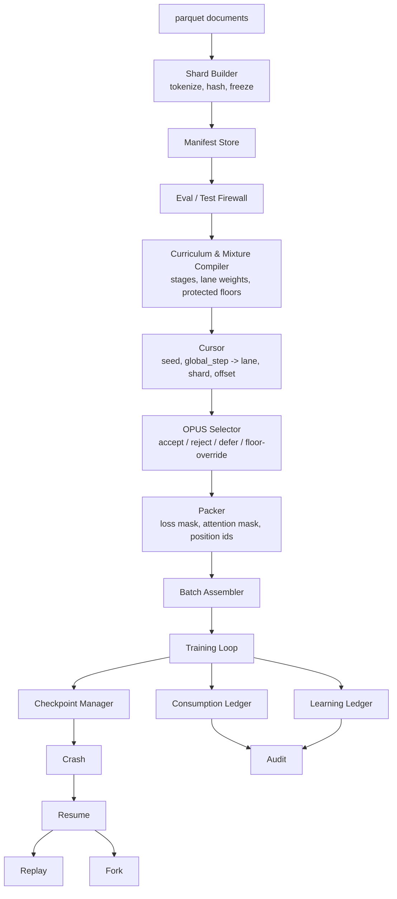

# V5 Training Data Execution System — Dataloader Design

Status: draft for team review
Scope: single-GPU training run, corpus supplied as parquet files, small/toy tokenizer and model
Assignment reference: `assignment.txt` ("Training Data Execution System")

## 1. Why this design exists

The v4 run worked, but the data path around it didn't hold up:

- Training steps couldn't be reliably reproduced.
- There was no record of which tokenized shards were consumed at which stage of model growth.
- Resuming an interrupted run was not smooth — the dataloader's internal state didn't survive a crash cleanly.

All three symptoms come from the same root cause: **the training stream was not a pure function of state.** If "what batch comes next" depends on something live (an in-memory shuffle buffer, a file-position cursor, a re-shuffled worker queue), then resume, replay, and audit are all best-effort, not provable.

## 2. Core invariant

```
training stream at step N = f(frozen manifests, mixture/curriculum config, seed, N)
```

Everything in this design either **implements** that function (the cursor, the packer) or exists to **record what the function actually produced** (the ledgers) so it can be checked, replayed, or audited later. Single-GPU training removes the hardest part of enforcing this in a real cluster — there's no rank/worker partitioning to keep in sync — so this design can implement the invariant exactly rather than approximately.

## 3. Terminology

| Term | Meaning |
|---|---|
| **Shard** | An immutable tokenized object. Once written, never edited — a change produces a new shard with a new content hash. |
| **Manifest** | The record describing a shard: content hash, tokenizer hash, source provenance, token count, capability lane, contamination/eval-overlap status. |
| **Lane** (capability lane) | A capability bucket a shard belongs to (`general_web`, `code`, `math_science`, `indic`, `agentic`, `reasoning`, ...). Defined by a tag on the shard manifest. |
| **Token range** | How a curriculum stage's boundaries are expressed — in cumulative training tokens consumed, not step count. Keeps the curriculum meaningful even if batch shape (GPU count, microbatch, grad-accum) changes later. |
| **Lane weight** | The target fraction of a stage's tokens that should come from a given lane. |
| **Protected floor** | A minimum guaranteed share for a lane, which selection cannot push below even under scarcity or low proxy-utility scores. Guards against undervaluing scarce/hard lanes. |
| **Cursor** | The deterministic function `(seed, mixture_config, global_step) -> (lane, shard_id, token_offset)`. The thing that makes resume/replay possible without saved iterator state. |
| **Branch** | A lineage identifier *inside the consumption ledger* — not a git branch. Resuming stays on the same branch; forking starts a new one from a recorded divergence point. |
| **Ledger offset** | `global_step` value tied to a checkpoint; the point the ledger and the checkpoint agree on. |

## 4. Pipeline



OPUS is included in this diagram per team request, but its *selection logic* (proxy scoring, accept/reject/defer decisions) is out of scope for this phase and will be designed separately. For now it is implemented as an **identity pass-through** — every candidate the cursor proposes is accepted — with the full interface and ledger schema wired so real scoring logic can be dropped in later without touching anything upstream or downstream.

## 5. Components

### 5.1 Shard Builder & Manifest Store

Reads parquet documents (already cleaned/admitted upstream per the source/admission contract — provenance, license, capability tags, held-out status assumed present as columns). Tokenizes with a frozen tokenizer, writes an immutable token array plus a sidecar manifest.

Shard manifest (per shard):

```json
{
  "shard_id": "shard-000123",
  "content_hash": "sha256:...",
  "tokenizer_hash": "sha256:...",
  "source_ids": ["source-42"],
  "document_ids": ["doc-9981", "doc-9982"],
  "token_count": 1048576,
  "language": "en",
  "capability_lane": "code",
  "license_tier": "tier_a",
  "cleaning_pipeline_hash": "sha256:...",
  "dedup_status": "deduped",
  "contamination_status": "clean",
  "eval_overlap_status": "none",
  "parent_shard_ids": []
}
```

The manifest store is append-only. Loading a shard always re-validates `tokenizer_hash` against the run's frozen tokenizer before use.

### 5.2 Eval / Test Firewall

A registry of held-out content hashes (eval + validation + test). Any candidate shard whose document hashes overlap this registry is blocked from ever entering a loss-bearing batch — this is checked before the mixture compiler sees it, not after. Blocked attempts are logged as events (`eval_shard_blocked`), not silently dropped, so the firewall itself is auditable.

Validation shards may be *read* for periodic evaluation but are never routed into a loss-bearing training batch — the firewall enforces that distinction structurally (a shard is either in the training pool or the eval/validation pool, never both).

### 5.3 Curriculum & Mixture Compiler

Converts human-authored curriculum stages into an executable schedule. Stage definition:

```json
{
  "stage": "reasoning-heavy-midtrain",
  "token_start": 1800000000000,
  "token_end": 2400000000000,
  "sequence_length": 8192,
  "mixture": {
    "general_web": 0.32, "code": 0.22, "math_science": 0.18,
    "indic": 0.12, "agentic": 0.06, "reasoning": 0.10
  },
  "protected_floors": { "indic": 0.08, "agentic": 0.03, "reasoning": 0.05 },
  "warmup_tokens": 20000000000
}
```

The compiler:

- converts `token_start`/`token_end` into a `global_step` range using `sequence_length x global_batch_size`;
- validates that available shard token counts per lane can satisfy the stage's share (flags scarcity rather than silently under-filling — via repeat, synthetic generation, reduced share, or deferral to a later stage, whichever the operator picks);
- reserves protected-floor tokens for scarce lanes before any scoring/selection layer touches the pool, so a low proxy score can't starve them below floor.

Output: `mixture_schedule.json` — one compiled record per stage, plus the step ranges.

### 5.4 Cursor

Pure function, no persisted state:

```python
def cursor(run_config, global_step):
    stage = lookup_stage(run_config.curriculum, global_step)
    lane = pick_lane(run_config.seed, stage, global_step)          # deterministic weighted pick
    k = picks_so_far_in_lane(run_config.seed, stage, lane, global_step)  # closed-form count
    shard_id, offset = lane_sequence(run_config.seed, lane)[k]     # seeded permutation, not live shuffle
    return CandidateItem(lane, shard_id, offset)
```

`lane_sequence` is a seeded deterministic permutation of a lane's shard IDs (reshuffled per epoch using a derived seed), computed as a formula rather than maintained as a stateful shuffle buffer. This is what makes "recompute step N from scratch" cheap and correct instead of "replay everything from step 0."

### 5.5 OPUS Selector (interface only — logic deferred)

Sits between the cursor and the packer. Interface:

```python
def select(candidates: list[CandidateItem], context: SelectionContext) -> SelectionResult:
    ...
```

For this phase, `select()` is an identity pass-through: every candidate is accepted, `status="accepted"`, `opus_score=None`. The ledger schema still carries the full field set (see §6) so that swapping in real scoring later requires no changes to the cursor, packer, or ledgers — only this function's body.

When implemented, this component owns: proxy-scored accept/reject/defer decisions, protected-floor rescue of rejected candidates from protected lanes, and recording *why* a candidate was rejected (low proxy utility, quota pressure, duplication, stage mismatch). Rejected candidates are never discarded from the record — a batch low-value now may be valuable at a later stage.

### 5.6 Packer

Fills fixed-length sequences from accepted candidates. Default policy: **concatenate-and-chop** (documents joined with EOS markers, fixed windows cut from the resulting stream) — matches the plain-pretraining scope of this demo. A second policy, **structure-preserving**, is also implemented to demonstrate the "packing policies for different data types" requirement, for a lane with role-tagged (prompt/response) records.

Per packed sequence, the packer tracks, per token position:

- `segment_id` — a *local* index (0, 1, 2, ... within this packed window) identifying which document a token came from. Derived once, at pack time, from the `document_spans` already recorded in the source shard's manifest — the packer knows exactly which document boundary it just sliced across. Distinct from the corpus-wide `document_id` (kept separately, for provenance in the ledger); `segment_id` only needs to be locally unique.
- `position_id` — resets to 0 at each segment boundary (correct for RoPE);
- `loss_mask` — 1 by default; 0 for padding positions, 0 for the sequence's final position (no next-token target), and 0 for non-response tokens in structure-preserving lanes;
- `attention_rule` — causal AND same-segment (token *i* attends to *j* iff *j ≤ i* and `segment[j] == segment[i]`), which is what stops cross-document attention leakage without needing a separate learned mechanism.

These four are parallel arrays alongside `token_ids`, all produced together as part of the **packed sample record** — the object actually handed to the model each step. They are not stored redundantly across the whole corpus; a packed sample is regenerated deterministically on demand (shard + offsets + manifest boundaries → array slicing, no re-tokenization), or cached only for debug-heavy runs.

Worked example — two documents packed into one 10-token window, doc A (4 tokens) + EOS + doc B (5 tokens), plain pretraining:

```
position:     0   1   2   3   4    5   6   7   8   9
token:        a0  a1  a2  a3  <eos> b0  b1  b2  b3  b4
segment_id:   0   0   0   0   0     1   1   1   1   1
position_id:  0   1   2   3   4     0   1   2   3   4
loss_mask:    1   1   1   1   1     1   1   1   1   0
```

Two things worth noticing here: the EOS-to-`b0` prediction (position 4→5) is *not* loss-masked — plain pretraining treats "a new document starts here" as useful signal — while attention still blocks `b1` (position 6, segment 1) from seeing positions 0–3 despite being causally earlier, because they're a different segment. Loss masking and attention masking are independent decisions answering different questions: *what counts toward the gradient* vs. *what context the model is allowed to look at*. The attention rule is never materialized as an explicit L×L matrix — it's evaluated from the O(L) `segment_id` array at attention-computation time (a bias added to attention scores before softmax, or via a varlen/segment-aware attention API), since a dense pairwise mask would be wasteful and fully redundant with `segment_id` anyway.

`loss_mask_hash` and `segment_boundaries` are computed once here and reused everywhere downstream (ledger, replay comparison) — they are never recomputed differently in two places. Note the hash is a compact fingerprint for the ledger (see §5.8), not a substitute for the actual array — training itself, and any later inspection of "which positions contributed," uses the real `loss_mask` array, not the hash.

### 5.7 Batch Assembler

Groups packed sequences into microbatches. Single-GPU: microbatch = global batch unless gradient accumulation is configured, in which case global batch = microbatch x accum_steps (no cross-rank concerns to handle).

### 5.8 Consumption Ledger

Append-only. One record per microbatch actually served:

```json
{
  "run_id": "run-2026-08-15-a",
  "branch_id": "main",
  "global_step": 843219,
  "microbatch_id": "mb-843219-0",
  "packed_sample_ids": ["ps-...", "ps-..."],
  "shard_ids": ["shard-000123"],
  "token_span_ids": ["shard-000123:0-8192"],
  "loss_mask_hash": "sha256:...",
  "attention_policy": "causal+segment",
  "position_policy": "reset_per_segment",
  "mixture_lane": "code",
  "curriculum_stage": "reasoning-heavy-midtrain",
  "tokenizer_version": "tok-v3",
  "dataloader_version": "loader-v5.0",
  "opus_decision_id": "opus-000123-accept"
}
```

This is the run's memory. It is what resume, replay, and audit all read from — never a live queue.

`loss_mask_hash` is deliberately a hash, not the full array — storing every position's mask for every step across a real run would dwarf the rest of the ledger. Its job is verification, not inspection: to prove a resumed or replayed step produced the identical mask as the original, recompute the packed sample for that step (cheap and deterministic — see §6), hash its `loss_mask`, and compare to this field. A match is the proof; if you need to actually *see* which positions contributed (debugging, not just verifying), that same recomputation hands back the real array, not just its hash.

### 5.9 Learning Ledger

Per shard / lane / token cluster, tied to consumption entries by `global_step`:

```json
{
  "global_step": 843219,
  "shard_id": "shard-000123",
  "avg_token_loss": 2.14,
  "loss_delta_before_after": -0.08,
  "opus_score": 0.61,
  "repeated_pass_number": 1,
  "model_phase": "mid",
  "usefulness_classification": "useful"
}
```

Feeds back into future curriculum/OPUS decisions (out of scope to act on automatically in this phase — recorded for the next version to consume).

### 5.10 Checkpoint Manager

Saves atomically: model weights, optimizer state, RNG state, and exactly `(run_id, branch_id, global_step)`. Deliberately does **not** save dataloader iterator state — see §6.

### 5.11 Crash / Resume

See §6 (dedicated deep dive — this is the component that fixes v4's core problem).

### 5.12 Replay

Given a historical `(branch_id, step_range)`, recompute the stream using only the frozen manifests + mixture config (the same `cursor` + `packer` call used live), and hash-compare the result against the ledger entries already recorded for that range. A match proves the historical stream is reconstructible from config alone, not from any cached batch data.

### 5.13 Fork

Restore a checkpoint, assign a new `branch_id`, and diverge the schedule (new seed component, different mixture config, or later stage) from that exact `global_step`. The ledger records the fork point (`parent_branch_id`, `fork_step`) so two branches sharing a checkpoint but different subsequent data are always distinguishable.

### 5.14 Audit

Given a step or step range, reconstruct which shards/lanes/capability tags contributed, with what packing utilization and useful-loss-bearing-tokens/sec — purely by reading the consumption + learning ledgers, no re-running of training required.

## 6. Crash / Resume — detailed walkthrough

**What the checkpoint stores about the dataloader: three values.** `run_id`, `branch_id`, `global_step`. Nothing else — no serialized iterator, no pickled shuffle buffer, no saved file-position cursor.

**Why that's enough:** the cursor is a pure function of `(seed, mixture_config, global_step)`. Given the same three checkpoint values plus the run's frozen config, *any* process — the same one that crashed, a different machine entirely — can recompute exactly which shard/offset should be served at any step, including the very next one after the crash. There is no mutable state to lose.

Resume procedure:

1. Load checkpoint → model/optimizer tensors, RNG state, `(run_id, branch_id, global_step)`.
2. **Recompute, don't restore**: call `cursor(seed, mixture_config, global_step + 1)`. This is arithmetic (a formula lookup), not re-tokenization or re-reading parquet.
3. Run the result through the same packer used live to build the "next batch" descriptor (shard ids, token spans, loss mask), and hash it.
4. **Prove it against a control run**: a full run of the same config with no crash already has a consumption-ledger entry for `global_step + 1`. Assert the recomputed batch's `shard_ids`, `token_span_ids`, and `loss_mask_hash` exactly match that control entry. This assertion is what `[PASS] resume_next_batch_matched` in the execution log actually certifies — not "the loader didn't crash again," but "the loader produced the provably identical batch a from-scratch run would have produced."
5. Resume training, appending to the *same* ledger under the *same* `run_id`/`branch_id` (resume never creates a new branch — only fork does).

This is also why replay and audit are nearly free extensions of the same mechanism: replay is step 2 above run for an arbitrary historical range with an equality assertion; audit is step 2 run for a range with a report instead of an assertion.

## 7. Data schema reference

| Object | Key fields |
|---|---|
| Shard manifest | `shard_id`, `content_hash`, `tokenizer_hash`, `capability_lane`, `contamination_status`, `eval_overlap_status`, `parent_shard_ids` |
| Mixture stage | `stage`, `token_start`, `token_end`, `sequence_length`, `mixture`, `protected_floors`, `warmup_tokens` |
| OPUS decision | `candidate_id`, `shard_ids`, `capability_lane`, `curriculum_stage`, `opus_score`, `status` (accepted/rejected/deferred), `rejection_reason`, `protected_floor_override`, `effective_token_estimate` |
| Consumption ledger entry | `run_id`, `branch_id`, `global_step`, `shard_ids`, `token_span_ids`, `loss_mask_hash`, `mixture_lane`, `curriculum_stage`, `tokenizer_version`, `dataloader_version`, `opus_decision_id` |
| Learning ledger entry | `global_step`, `shard_id`, `avg_token_loss`, `loss_delta_before_after`, `opus_score`, `repeated_pass_number`, `model_phase`, `usefulness_classification` |
| Checkpoint metadata | `run_id`, `branch_id`, `global_step`, `parent_branch_id` (fork only), `fork_step` (fork only) |

## 8. Scope assumptions

- Corpus arrives as parquet with provenance/capability/license columns already populated (upstream admission contract, not re-implemented here).
- Tokenizer is a frozen, pre-existing artifact, hash-pinned — not trained by this component.
- Model is a small toy transformer, only large enough to produce real loss/perplexity numbers for the learning ledger — not a scale target.
- OPUS is included as an architected, documented, pluggable component (interface + ledger schema), but its actual selection logic is deferred — implemented as an identity pass-through for this phase.
- Single-GPU: no rank/worker partitioning logic; simplifies the cursor (no rank as an input) versus a multi-GPU version of this design.

## 9. Open questions for the team

- Should protected-floor accounting be enforced even before OPUS is real (i.e., does the pass-through selector need to honor floors), or is that meaningless until scoring exists to violate them?
- What repeat/synthetic/defer policy should the mixture compiler default to when a lane is scarce, for this demo's toy corpus?
- Do we want structure-preserving packing demonstrated on a real second lane (e.g. a small SFT-style set) or is a synthetic role-tagged example sufficient to prove the mechanism?
