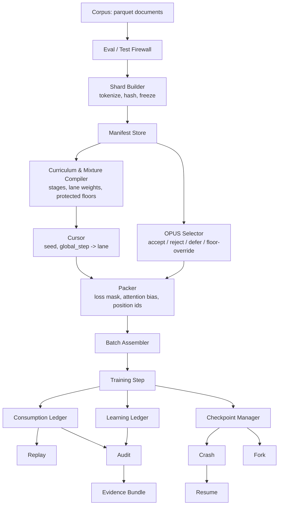

# Training Data Execution System

A small but complete data-execution pipeline for training an LLM: documents go in, and out come immutable tokenized shards, a compiled curriculum/mixture schedule, packed batches, a real (toy-scale) training loop, and a full audit trail — consumption ledger, learning ledger, checkpoints, crash recovery, replay, branch forking, and a machine-generated evidence bundle.

The scope is deliberately small (a toy transformer, a few hundred to a few thousand documents). The goal is not scale — it's to prove that the data path is **correct, reproducible, auditable, and efficient**, end to end, with evidence generated by the code itself rather than asserted in prose.

## Core invariant

Everything in this repository either *implements* or *records the output of* one function:

```
training stream at step N = f(frozen manifests, mixture/curriculum config, seed, N)
```

If "what batch comes next" only ever depends on frozen, hash-pinned inputs plus a step number — never on live, in-memory state like a shuffle buffer or a file cursor — then resume, replay, and audit stop being best-effort and become provable. Single-GPU scope removes the one thing that would make this hard to enforce exactly (rank/worker partitioning), so this system implements the invariant literally rather than approximately.

## Architecture



Each box is a real, independently-tested module under `tds/`:

| Stage | Module(s) | What it does |
|---|---|---|
| Corpus | `tds/corpus.py` | Loads parquet documents, maps each to a *capability lane* (`code`, `qa`, `math_science`, `indic`, `instruction`, `general_web`) from its `domain`/`language` columns |
| Eval/Test Firewall | `tds/eval_registry.py`, `tds/eval_firewall.py`, `tds/hashing.py` | A persistent registry of held-out content hashes; any document whose *content* (not id/source) matches is blocked before it ever reaches the tokenizer |
| Shard Builder & Manifest Store | `tds/tokenizer_utils.py`, `tds/shard_builder.py`, `tds/manifest_store.py` | Trains a frozen byte-level BPE tokenizer, packs admitted documents into immutable, lane-homogeneous, content-hashed shards, and records them in an append-only manifest store |
| Curriculum & Mixture Compiler | `tds/mixture_compiler.py` | Turns human-authored stages (token ranges, lane weights, protected floors) into a `CompiledSchedule` that maps any `global_step` to a stage and an effective per-lane mixture, checked against real shard supply |
| OPUS Selector | `tds/opus.py` | Proxy-scores every candidate document under a model snapshot once, before training starts, and accepts/rejects/defers it (with protected-lane floor rescue) |
| Cursor | `tds/cursor.py` | Pure, history-free functions mapping `(seed, global_step, slot)` to a lane, and a per-lane deterministic document stream — no shuffle buffer, no persisted iterator |
| Packer | `tds/packer.py` | Fills fixed-length windows from a lane's document stream, tracking `segment_id`, `position_id`, and `loss_mask` per token, with carry-over so no document is ever split incorrectly, dropped, or duplicated |
| Batch Assembler | `tds/batch_assembler.py` | Slices one step's packed sequences into microbatches and stacks them into model-ready arrays |
| Toy Model & Training Step | `tds/model.py`, `tds/training_step.py` | A small hand-written decoder-only transformer (segment-aware attention bias, position resets) and a training step that evaluates loss before and after one optimizer update |
| Consumption Ledger | `tds/consumption_ledger.py` | Append-only record of every microbatch actually served — shard ids, token spans, a loss-mask hash, the OPUS decisions behind it |
| Learning Ledger | `tds/learning_ledger.py` | Per-shard loss attribution tied to consumption entries — before/after loss, repeated-pass count, model phase, an OPUS-score rollup, a simple usefulness classification |
| Checkpoint / Crash / Resume | `tds/checkpoint.py`, `tds/resume.py` | Atomic checkpoints holding exactly `(run_id, branch_id, global_step)` plus model/optimizer/RNG state; resume recomputes the next batch from frozen inputs and proves it matches a control run |
| Replay / Fork | `tds/replay.py`, `tds/fork.py` | Recompute-and-compare over an arbitrary historical range; restore-and-diverge into a new branch from any checkpoint |
| Audit / Evidence Bundle | `tds/audit.py`, `tds/evidence.py` | Ledger-only reconstruction of what a run actually did (shards/lanes touched, packing utilization, useful tokens, mixture compliance, branch lineage), plus a bundle that can only ever report what was actually computed |

`scripts/run_demo.py` wires all of the above into one run.

## Key design decisions

**The cursor is split into two independent questions.** *Which lane* does slot `(global_step, slot)` draw from is a pure O(1) hash of `(seed, global_step, slot)` against the mixture weights — no history, evaluable in any order. *Which document* comes next within a lane is a different question: the Packer's per-lane stream position is cumulative (it depends on exactly how much of the stream every earlier step's windows already consumed), so recomputing an arbitrary step still means replaying every step before it. Both facts are real: recomputing lane assignment is genuinely O(1); recomputing a specific batch is `O(global_step)`, not `O(1)` — a checkpoint stays tiny (three values plus model/optimizer state) at the cost of a bounded, sub-second replay at resume time, rather than a large checkpoint that also has to save iterator state.

**Every frozen artifact follows the same pattern.** The tokenizer, the compiled mixture schedule, and OPUS's decisions are each written with a sha256 hash sitting alongside them, and each has a `load_frozen_*` function that recomputes the hash and refuses to proceed on a mismatch. A resumed or replayed run reloads these rather than recomputing them from scratch — recompiling the schedule from "whatever shards exist right now" instead of a frozen file would silently change which lane a step draws from if shards were rebuilt in between.

**The Packer has two independent axes.** *Loss-masking policy* (`concatenate_and_chop` vs. `structure_preserving`) decides what counts toward the gradient — plain pretraining treats a document boundary as useful signal, while role-tagged (prompt/response) data masks the prompt portion. *Sequence-packing policy* (`greedy` vs. `best_fit`) decides which document gets pulled next to fill a window's remaining room. These are orthogonal: a lane can be `structure_preserving` and `best_fit` at once. Neither policy ever pads — every window is always filled exactly, so packing utilization is provably `1.0`, not just reported as such.

**OPUS runs once, globally, before the Packer or Cursor exist — not inline per step.** Weaving a live model into the Packer's per-step loop would mean the training stream depends on live model state, breaking the property every other component preserves (pure functions of frozen inputs). Instead, OPUS scores every candidate document once against a model snapshot, and the *filtered* document pool — not the model — is what the Packer ever sees. A rejected document simply never appears anywhere downstream. Because scoring depends on a specific, possibly-still-training model snapshot, OPUS's own decisions are frozen and hash-verified exactly like the tokenizer and schedule are, rather than treated as reproducible from static config alone.

**The evidence bundle cannot hardcode a result by construction.** `build_evidence_bundle` only ever assembles already-computed `EvidenceRow(requirement, passed, evidence)` values — there is no code path inside it that could decide "PASS" on its own. Every row in `scripts/run_demo.py` is wired to a real check that already ran earlier in the same run (a resume-verification match, an actual blocked-document count, a live audit field).

**Ledgers are append-only with the same mutation guard throughout.** The manifest store, eval registry, consumption ledger, and learning ledger all share one rule: re-appending identical content under an existing key is a harmless no-op (so a crash-recovery retry never corrupts anything), but appending *different* content under a key already in use raises loudly. That single rule is what would catch "resume produced a different batch than the original run" the instant it happened, rather than letting it silently drift.

## Assumptions and known scope boundaries

- **Corpus**: parquet with `id`, `source`, `domain`, `language`, `text` columns; capability lane is derived from `domain`/`language`, not assumed pre-tagged. A real vendored corpus (~850 admitted documents, 6 lanes) and a tiny hand-authored fixture (11 documents) are both checked in under `data/corpus/`.
- **Tokenizer and model are both small by design**: a fresh byte-level BPE tokenizer trained specifically for this corpus, and a hand-written, configurably tiny decoder-only transformer — large enough to produce real, non-fabricated loss numbers for the learning ledger, not a scale target.
- **Single-GPU**: no rank/worker partitioning anywhere; gradient accumulation (`global_batch_size = microbatch_size × accum_steps`) is supported and configured in both shipped profiles.
- **OPUS's scoring is a simplification, stated plainly**: each candidate is scored by its own average per-token loss under the current model snapshot — a self-referential "how surprising is this right now" signal. There is no separate curated reference/"golden" set and no excess-loss-against-a-reference-model comparison; a more faithful proxy-scoring implementation would add one. OPUS also runs as a single global pass rather than being re-run per curriculum stage against an evolving model snapshot — see *Known limitations* below.
- **Structure-preserving prompt/response detection is a bounded heuristic**: a short, curated list of common template markers (`response:`, `output:`, `answer:`, `assistant:`), matched as plain case-insensitive substrings — not a general-purpose boundary detector. A document using none of them degrades gracefully to "fully response" rather than mis-splitting.
- **Useful loss-bearing tokens have two accounting paths, both real**: a fast, ledger-only *estimate* (exact for plain-pretraining lanes, an honest over-count for structure-preserving ones, since the full loss-mask array isn't stored in the ledger by design), and an *exact* count obtained by recomputing the actual stream and summing the real mask — both are reported, with the estimate explicit about which case it's exact in.
- **Two independent, non-overlapping entry points exist on purpose.** `scripts/run_demo.py` is fully self-contained and is the one command this system requires. `scripts/run_pipeline.py → compile_mixture.py → run_opus_selection.py` (plus `build_eval_registry.py`) is a separate, optional workflow for iterating on one pipeline stage at a time; neither reads the other's file outputs, though both read the same `configs/*.yaml` profiles.

## Repository layout

```
tds/                      core library (one module per component, see table above)
scripts/                  run_demo.py (required entry point) + the standalone per-stage scripts
configs/                  one YAML profile per component, "real" and "_toy" variants
tests/                    unittest suite, one file per tds/ module
data/                     corpus, tokenizer, shards, manifests, compiled schedule, OPUS decisions
submission_artifacts/     written fresh by every run_demo.py run (see below)
DATALOADER_DESIGN.md      original architecture/schema reference
IMPLEMENTATION_NOTES.md   detailed build log: every design decision, bug caught, and test, section by section
```

This README is the short version; `IMPLEMENTATION_NOTES.md` is the long one, with real numbers, worked examples, and the handful of real bugs that building this system surfaced (a step-numbering regression when stages change `sequence_length`, a tautological scarcity check, a resume implementation that initially jumped straight to a step instead of replaying to it, and others) — read it for the "why," not just the "what."

## How to run the demo

```bash
pip install -r requirements.txt

python scripts/run_demo.py                  # real vendored corpus (default)
python scripts/run_demo.py --corpus toy      # tiny fixture: fast, fully deterministic, human-checkable
python scripts/run_demo.py --num-steps 200   # override the step count (default: min(schedule.total_steps, 50))
```

One command builds the tokenizer, shards, and manifests; compiles the mixture schedule; runs OPUS selection; trains the toy model for real steps; saves a checkpoint; deliberately simulates a crash and resumes from it; replays the pre-crash history; forks a branch; audits the run; measures throughput; and writes the evidence bundle. No manual steps in between.

To run the automated test suite:

```bash
python -m unittest discover -s tests -p 'test_*.py'
```

## Expected outcome

Every run writes a fresh `submission_artifacts/`:

```
submission_artifacts/
  run.log                 complete, in-order event log
  evidence.json           machine-readable PASS/FAIL per requirement
  evidence.md             human-readable summary table
  manifests/              shard manifests from this run
  ledgers/consumption/    ledgers/learning/    append-only records
  checkpoints/            one saved checkpoint, plus the forked branch's own
  performance.json        throughput numbers
```

`run.log` contains the full event sequence the assignment specifies, in the order they actually happen (the eval firewall runs before shard creation, since shards are only ever built from admitted documents):

```
[event] evaluation data blocked (...)
[PASS] eval_shard_blocked: ...
[PASS] tokenizer_hash_verified: sha256:...
[event] shards created (N shards)
[event] manifests validated (N shard manifests on record)
[event] mixture compiled (3 stages, total_steps=1659)
[event] OPUS decisions recorded (.../... accepted, enabled=True)
[PASS] checkpoint_saved step=...
[event] batches packed (50 steps trained)
[event] crash simulated after step ...
[event] run resumed from checkpoint step=...
[PASS] resume_next_batch_matched step=... batch_ids=[...]
[event] historical stream replayed (steps [0, ...))
[PASS] replay_hash_matched steps=[0,...)
[event] branch forked parent=main fork_step=... new_branch=fork-1
[event] branch lineage reconstructed (chain=['main', 'fork-1'], total_samples=...)
[event] audit completed (lanes=[...], shards=..., packing_utilization=1.000)
[event] exact useful tokens recomputed (estimated=..., exact=...)
[event] performance measured (tokens/sec=..., useful_tokens/sec=...)
=== Demo complete: overall=PASS ===
```

`evidence.md` reports on eleven requirements — the nine the assignment lists plus two the audit layer was extended to cover (exact useful-token accounting and fork-branch lineage). Every row's evidence string is generated from a real value computed during that run, for example:

| Requirement | Result | Evidence |
|---|---|---|
| Tokenizer integrity | PASS | tokenizer_manifest.json hash re-verified on load |
| Evaluation firewall | PASS | N document(s) blocked by content hash |
| Packing correctness | PASS | packing_utilization=1.0000 (from consumption-ledger token spans) |
| Useful token accounting | PASS | ledger-derived estimate vs. a full recompute — must agree on served tokens |
| Mixture compliance | PASS | planned vs. actual per-lane shares |
| OPUS audit trail | PASS | N/N candidates accepted, decisions_hash=sha256:... |
| Crash recovery | PASS | expected batch ids at the resume step == resumed batch ids |
| Replay | PASS | recomputed-from-scratch hashes match the original consumption ledger |
| Learning trace | PASS | N learning-ledger entries, each linked to a real manifest shard_id |
| Fork lineage | PASS | forked branch's full history reconstructed across its ancestor branches |
| Throughput | PASS | tokens/sec and useful-tokens/sec from live wall-clock timing |

Exact hashes, shard counts, and step numbers will differ if the corpus, `shard_token_budget`, or curriculum config changes — that's expected. What shouldn't change is `overall: PASS`, and a determinism check (run the same corpus/config twice, diff `evidence.json`) should come back byte-for-byte identical everywhere except the throughput numbers, which are a live wall-clock measurement and are the one thing this system's reproducibility guarantee was never meant to cover.

## Known limitations / natural next steps

Recorded here rather than glossed over, since a system whose whole point is honest auditing should be honest about its own edges too:

- **OPUS's proxy score is self-referential**, not measured against a curated reference/"golden" set. A closer match to real proxy-based data-selection methods would score by excess loss relative to a reference model, or by gradient alignment with a target-distribution set.
- **OPUS runs once, globally, before training starts** rather than being re-scored per curriculum stage against the model's evolving state. It can report which stage(s) a rejected document's *lane* would have fed (`curriculum_stages` on each decision), but not a true per-stage, per-candidate decision — a genuinely bigger extension involving snapshotting and re-freezing decisions at each stage boundary.
- **Structure-preserving marker detection** is a small, hand-curated substring list, not a general prompt/response parser; a corpus using conventions outside that list degrades gracefully rather than mis-splitting, but isn't detected either.
- **The standalone per-stage scripts and `run_demo.py` intentionally never share file outputs** — a design choice for keeping the required one-command demo fully self-contained, at the cost of the standalone scripts not being consumed by anything else in the repo.
